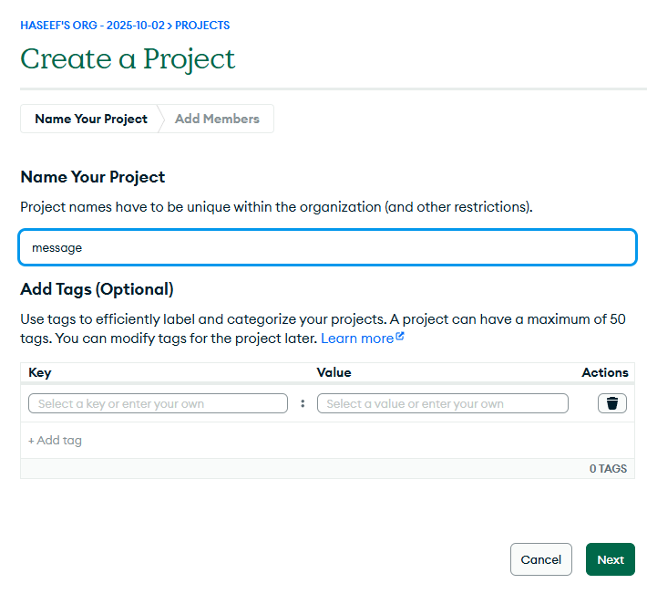

# Host The Mern Stack Application 
> - Host the Frontend Using the Vercel Service
> - Host the backend Using the redner Service
> - Deploy the Database using the mongoDB. 

> ## MONGODB
>> - Login MONGOBD Dashboard
>>> 

>> - Create a New Project
>>> 

>> - Enter the Project Name
>>> 

>> - Deploy the Cluster
>>> 

>> - Configure the User Credential For DB
>>> 

>> - Select the perfect connect
>>> - Select the **Driver**
>>> 

>>> - copy the connection strink address 
>>> 
>>> 

>>> - verify the created user
>>> 

> ## Host the frontend using the vercel
>> - Import the source files from git repo
>>> 

> ## Push the Code to GitHub 
>> 

> ## Deploying the frontend in Vercel
>> 

>> ## Verified the Hosting Frontend
>>> 

> **Error**
>> - When we try to access the Database using the browser. its not appear here. 
>>> 

>> - so we need to create a file vercel.json to overwrite the croute configuration. and put the some source code.
>> - then push the code to git repo. the Deployment is running Automatically.
>>> 

> ## Host the Backend using the render Service
>> - Login the Render using the Mail.

>> - Select the **web service** to host the backend.
>>> 

>> - Select the public Repo from github
>>> 

>> - Enter the Proper name of this project
>> - set the root Directory into our project.
>> - enter the build and start command of backend.
>>> 

>> - Set the Env veriables of the DB server and frontend application URL too. in backend service provider.
>>> 

>> - Then Redeploy the Backend provider.

>> - Copy the URL of the backend. then Go to frontend provider.
>> - Add the URL in frontend environment.
>>> 

>> - Redeploy the backend as manually. 

>> - Mern stack application is completly Working
>>> 

>>> 

>>> 

>>> 

> ## Auto Deployment When we push the Code to Repo. it will deploy as automatically 
>> 
>> 

> ## Access URLs
>> - Frontend   : https://messageappclient.vercel.app
>> - Backend    : https://messageappclient.vercel.app/messages   